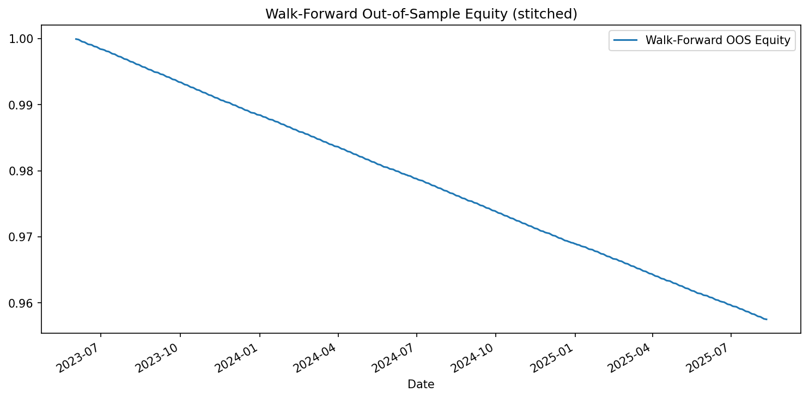

# Day 5 — Walk-Forward Analysis for Cross-Sectional Momentum (12-1)

## Overview
This project extends the Day 4 **Cross-Sectional Momentum** strategy by adding **Walk-Forward Analysis (WFA)** — a realistic, professional-grade testing method where:
1. The model is trained on a rolling historical window (in-sample).
2. Parameters are chosen based on in-sample performance.
3. The model is then tested on the **next** unseen period (out-of-sample).
4. Steps 1–3 repeat until the end of the dataset.

The result is a stitched **true out-of-sample performance curve** that simulates live trading conditions.

---

## Core Strategy
- **Signal**: 12-1 momentum = (Price[t−21] / Price[t−252]) − 1  
  (Skip the last month to avoid short-term reversal effects.)
- **Universe**: Sector ETFs + TLT + GLD by default.
- **Portfolio**: Equal-weight top-N ranked assets.
- **Rebalancing**: Monthly (`ME`) or quarterly (`QE`).
- **Costs**: Transaction costs in basis points and cash drag from the risk-free rate.

---

## Installation
From the repo root:
python -m venv .venv
. .venv/Scripts/activate  # Windows PowerShell
pip install -r requirements.txt
Usage

Default (5-year train, 1-year test, top grid = 2,3,4, monthly rebalance):
python day05_walkforward.py

### Debug Mode: See Why the Curve Moves
To understand why the walk-forward OOS curve slopes up or down, turn on debug logging:

python day05_walkforward.py --debug True

Custom Example:
python day05_walkforward.py \
  --tickers XLB,XLE,XLF,XLI,XLK,XLP,XLU,XLV,XLY,XLC,TLT,GLD \
  --start 2005-01-01 \
  --train_years 6 \
  --test_years 2 \
  --top_grid 3,5,7 \
  --reb Q \
  --rf 0.03 \
  --tc_bps 15
  
  
CLI Parameters
--tickers: comma-separated tickers (default: sectors + TLT, GLD)

--start: start date (default 2005-01-01)

--reb: rebalance frequency (M = monthly, Q = quarterly → safe mapped to ME/QE)

--rf: annual risk-free rate for cash drag (e.g., 0.02)

--tc_bps: transaction costs in basis points per unit turnover

--lookback: lookback days for momentum (default 252)

--skip: skip days to avoid lookahead bias (default 21)

--train_years: training window size in years

--test_years: testing window size in years

--top_grid: candidate numbers of top assets to sweep in training

--outdir: output directory (default .)

Outputs
outputs/wf_period_results.csv — per-period test results (CAGR, Sharpe, etc.)

outputs/wf_oos_daily_returns.csv — full stitched OOS return series

charts/wf_oos_equity.png — OOS equity curve plot

Example Output (Illustrative)
=== Walk-Forward Period Results ===
period  train_start  train_end    test_start   test_end    chosen_top  CAGR   Sharpe   MaxDD   Vol    Hit%
1       2005-01-01   2009-12-31   2010-01-01   2010-12-31  3           0.110  0.75     -0.18  0.14   0.54
2       2006-01-01   2010-12-31   2011-01-01   2011-12-31  2           0.094  0.62     -0.21  0.13   0.53
...

=== Aggregate Out-of-Sample (stitched) ===
CAGR_OOS:   0.098
Sharpe_OOS: 0.690
MaxDD_OOS: -0.240
Vol_OOS:    0.130
Hit%_OOS:   0.532

Chart Preview

Research Context
Part of my doctoral research in Finance exploring how systematic strategies + disciplined validation methods (like walk-forward testing) can improve real-world portfolio performance stability.
This bridges academic rigor with practical quantitative trading system design.

Disclaimer
This is for educational and research purposes only. Past performance does not guarantee future results.