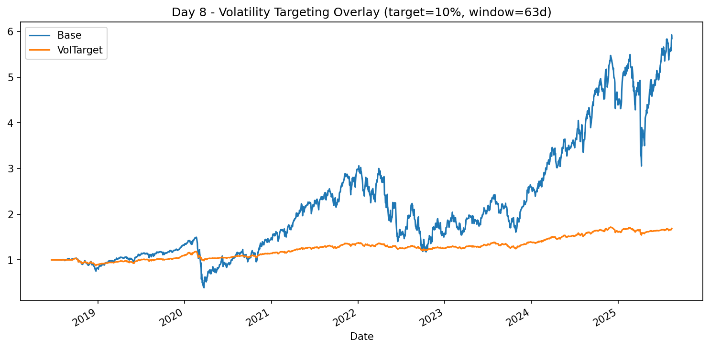

# Day 8 — Volatility Targeting Overlay

In this module, we extend our multi-asset portfolio backtesting framework with **volatility targeting**.  
The goal is to scale portfolio exposure so realized volatility matches a chosen target (e.g., 10% annualized), creating smoother equity curves and more controlled drawdowns.

---

## 📌 Strategy Overview
- **Base portfolio**: Equal-weight *top N* assets from our momentum filter.
- **Volatility targeting**: Adjust leverage daily based on trailing realized volatility.
- **Control parameters**:
  - `--target`: Annualized vol target (e.g., 0.10 for 10%)
  - `--window`: Lookback window for realized vol (trading days)
  - `--reb`: Rebalancing frequency (`M`=monthly, `Q`=quarterly)
  - `--top`: Number of top assets to hold
- **Scaling**: Exposure scaled proportionally to meet the target vol (capped at 3x leverage for safety).

---

## ⚙️ Features
- Imports signals from our momentum engine.
- Daily vol calculation using rolling standard deviation of returns.
- Automatic leverage adjustments.
- Comparative charts: Base portfolio vs. Vol-targeted portfolio.
- CSV exports for reproducibility.

---

## 📂 Outputs
- `outputs/day08_daily_returns.csv` — Daily returns for base and vol-targeted portfolios.
- `outputs/day08_equity_curve.csv` — Equity curves.
- `charts/day08_vol_target_equity.png` — Visual comparison.

---

## 🚀 Quickstart

```bash
# 1. Create and activate a virtual environment
python -m venv .venv
. .venv/Scripts/activate  # Windows PowerShell: .venv\Scripts\Activate.ps1

# 2. Install dependencies
pip install -r requirements.txt

# 3. Run the script
python day08_volatility_targeting.py --target 0.10 --window 63 --reb M --top 3
📊 Example Chart

Here’s an example equity curve output from a 10% target vol run:



📈 Key Takeaways

Vol targeting can smooth returns without necessarily improving CAGR.

Helps risk-adjust performance (Sharpe ratio often improves).

Critical to monitor leverage limits to avoid blow-ups.

🔗 Related Work

Day 3 — Equal-Weight Backtest

Day 4 — Cross-Sectional Momentum

Day 5 — Walk-Forward Optimization

Day 6 — Grid Search with Walk-Forward

Day 7 — Multi-Factor Model